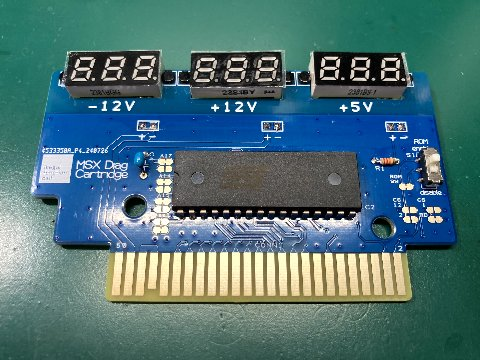

# MSX用カートリッジ<BR>MSX Diagnosis Cartridge
Cesar Rincon Nadal氏のMSX Diagnosticsを日本仕様のMSXにカスタマイズしたものを搭載したテストカセットです。  
VDP/PSG/KEYBOARDのテストなどが行えます。  

また、本体に供給されている5V/12V/-12Vの電圧のチェックも可能です。


  
本カセットはキット状態で、家電のKENちゃんにて頒布しています。  

## ■ 頒布先
### 家電のKENちゃん
●MSX用MSX Diagnosis Cartridge 【組み立てキット】  
https://www.kadenken.com/view/item/000000001821

●シェルケース（廉価版）  
- クリアブラック  
https://www.kadenken.com/view/item/000000001497  
- クリアブルー  
https://www.kadenken.com/view/item/000000001498  
- クリアピンク  
https://www.kadenken.com/view/item/000000001500  
- クリアオレンジ  
https://www.kadenken.com/view/item/000000001499  

シェルケース(RGR製)
- 透明  
https://www.kadenken.com/view/item/000000001315  


## ■ 基板上のスイッチについて	
基板上のスイッチの切り替えでROMソフトを有効/無効の切り替えが可能です。  
電圧計のみを使いたい場合は「無効」設定にしてお使いください。  

スイッチの設定は、上にすると「有効」、下にすると「無効」になっています。  

## ■ 搭載ソフトMSX Diagnosticsについて  
オリジナルはCesar Rincon Nadal氏が制作したソフトになります。許可をもらい搭載しています。  

そのままでは、日本仕様のMSXや一部機種で正常に動作しなかったため、当方で修正いれています。 
修正内容については下記レポジトリを参照ください。  

### MSX Diagnostics(日本仕様MSX対応版)  
https://github.com/v9938/msx_diagnostics

### Cesar Rincon Nadal氏WEBページ
https://nightfoxandco.com/

## ■ ソフトウェア アップデートについて  
不定期にソフトウェアのアップデートを行う事があります。  
UPDATE用のソフトウェア「diagup.com」は以下にあります。MSX-DOS上で実行してください。  

https://github.com/v9938/MSXDiagCartridge/tree/main/UPDATE

### ソフトウェアアップデート手順
 1. 基板上のスイッチを「無効」設定にします。
    
 2. MSX本体にカセットをセットし、MSX-DOSを起動します。  
    
 3. MSX本体の電源を入れたまま、基板上のスイッチを「有効」設定に切り替えます。 
    

 4. アップデート用のソフトを起動します。  
 ```  
>diagup
```  
 5. 正常に認識した場合、Updateするか確認が入りますので、「Y」キーを押します。  
  
下記メッセージの場合は、ROMが認識できていません、基板上のスイッチの状態を確認してください  
    
 6. アップデートが開始されます  
    
 7. 下記メッセージが出たらアップデート完了です。  
    


## ■ カセットの仕様について  
電圧計の追加以外は、当方が頒布を行っているMSX 64K Simple ROM Cartridgeと基本的に同じです。  
ソフトウェアの書き換えが必要な場合は、こちらで配布しているソフトを利用してください。  

### MSX 64K Simple ROM Cartridge  
https://github.com/v9938/MSX_SimpleCartridge  

## ■ 部品表
| 部品番号 | 部品名 |
|---|---|
| IC1  | Flash ROM SST39SF010 |
| C4  | コンデンサー0.1uF (104) |
| R1  | 抵抗10K～22K |
| S1  | スライドスイッチIS-2235 |
| PCB  | 専用PCB |
| -   | 電圧計x3(赤色/緑色/黄色 各１個)|
| -   | プラスチックリベット x6|


## ■ 基板の組み立て方法
セオリー通り背の低い部品から半田付けしてください。R1->C4->S1->IC1->電圧計の順番が良いと思います。  
ICソケットを使うとケースに入らなくなるので注意してください。  

### ○抵抗とコンデンサの取付  
  
  

### ○ROMの取付  
  

### ○スイッチの取付  
  


### ○電圧計を固定～配線～完成（色の順番に指定はありません。好みの配置で）  
  
  
  
  
※表面の保護シールは組み立て後、剥がしてください。


## ■ 電圧計の固定の仕方
電圧計の固定ですが、電圧計が下になるように所定場所に設置した上で左右の穴にプラスチックリベットを挿入固定してください。  
固定の仕方は下記写真の様に、穴にピンを挿入後、重ねた基板がずれない気をつけながら、中央の出っ張っているピンを上から押して押し込んでください。  
堅い場合があるので、割り箸の先の様な先端が平らな棒を使って押し込むとやりやすいと思います。  
  
  
  
  

## ■ 電圧計の色について
横面にかいてある、LEDの型番の最後の英字が文字色になります。  
「G」：緑色
「Y」：黄色
「BS」:赤色
「その他」:赤色

  

## ■ カードリッジシェルについて
コナミタイプのシェルに合わせたネジ穴が空けてあります。  
成型品については頒布先のURLを参照ください。  
トランスルーセント（半透明）のシェルを使用しないと、電圧計が見えなくなることに注意してください。  

